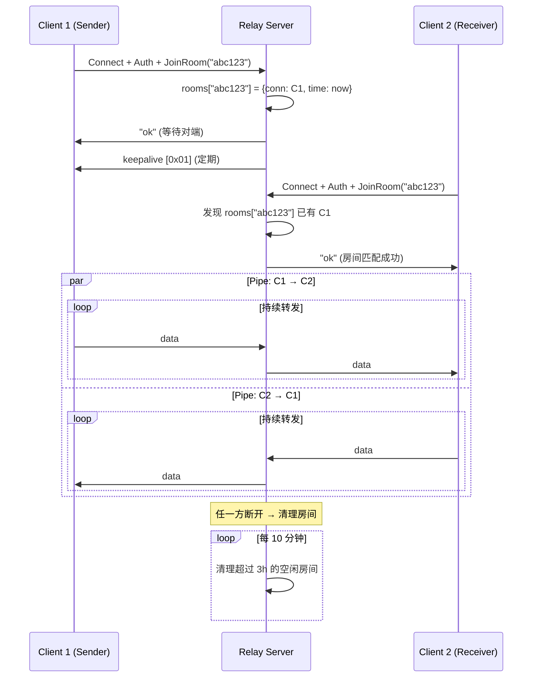
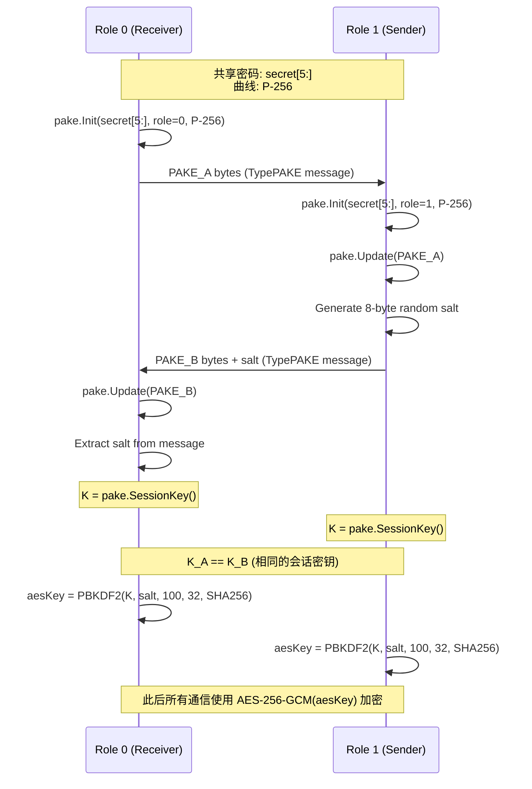
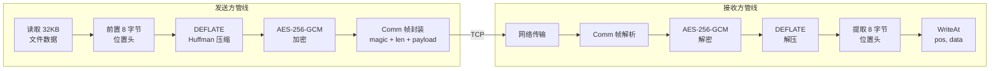

# rcroc — Rust Rewrite of croc Specification

> croc (https://github.com/schollz/croc) 的 Rust 重写技术规格书

---

## 1. croc 项目概述

croc 是一个 CLI 工具，用于在任意两台计算机之间进行简单、安全的文件/文件夹传输。核心特性：

- **任意端对端传输**：通过中继服务器（relay），无需端口转发
- **端到端加密**：PAKE（密码认证密钥交换）+ AES-256-GCM
- **跨平台**：Windows / Linux / macOS / Android / FreeBSD
- **多文件/文件夹**传输，支持断点续传
- **IPv6 优先**，IPv4 回退
- **代理支持**：SOCKS5 / HTTP CONNECT
- **管道支持**：stdin/stdout
- **文本消息**发送
- **QR 码**展示（移动端扫码接收）
- **.gitignore** 规则支持
- **上传限速**
- **压缩**：DEFLATE (Huffman-only)
- **自托管 relay** 服务器

---

## 2. 源码架构

### 2.1 目录结构

```
croc/
├── main.go                          # 入口：信号处理 → cli.Run()
├── go.mod / go.sum
├── Dockerfile / croc.service
└── src/
    ├── cli/cli.go                   # CLI 参数解析，send/receive/relay 子命令
    ├── croc/croc.go                 # 核心客户端逻辑（~2300行）：发送、接收、状态机
    ├── croc/ctx.go                  # Context/Cancellation 支持
    ├── tcp/tcp.go                   # Relay 服务器实现：房间管理、双向管道
    ├── tcp/options.go               # Server option 函数式配置
    ├── tcp/defaults.go              # 默认常量（房间 TTL、清理间隔）
    ├── comm/comm.go                 # 底层 TCP 通信：帧协议
    ├── crypt/crypt.go               # 加密：AES-256-GCM + ChaCha20-Poly1305
    ├── compress/compress.go         # DEFLATE (Huffman-only) 压缩
    ├── message/message.go           # 消息类型，编解码（JSON + 压缩 + 加密）
    ├── models/constants.go          # 常量：缓冲区大小、默认 relay 地址、DNS
    ├── utils/utils.go               # 工具：哈希、zip、分块、网络、助记码
    ├── mnemonicode/mnemonicode.go   # 助记词编码（4字节 → 3个词）
    ├── mnemonicode/wordlist.go      # 1626 词字典
    └── diskusage/                   # 平台相关磁盘用量查询
```

### 2.2 包依赖图

```
main → cli → croc → ┬─ tcp
                     ├─ comm
                     ├─ crypt
                     ├─ compress
                     ├─ message → {comm, compress, crypt}
                     ├─ models
                     ├─ utils → {mnemonicode}
                     └─ mnemonicode

tcp → {comm, crypt, models}
```

---

## 3. 核心协议详解

### 3.1 传输状态机（5 步）

```
Step1: ChannelSecured        — PAKE 交换完成，对称密钥建立
Step2: FileInfoTransferred   — 发送方发送文件元数据
Step3: RecipientRequestFile  — 接收方请求文件（附带缺失块范围）
Step4: FileTransferred       — 数据传输进行中（多路复用连接）
Step5: CloseChannels         — 传输完成，关闭通道
```

### 3.2 PAKE 密钥交换

使用 `schollz/pake/v3`，实现 PAKE2 协议（Boneh/Shoup）。

**支持的曲线**：SIEC（relay 认证默认）、P-256（文件传输默认）、P-384、P-521

**共享密码结构**：`NNNN-word1-word2-word3`（4位数字 + 3个助记词）

**密钥派生流程**：

1. **房间名** = `hex(SHA256(secret[:4] + "croc"))` — 前4字符用于路由
2. **PAKE 密码** = `secret[5:]` — 跳过4位数字和连字符
3. 接收方 init PAKE(role=0)，发送方 init PAKE(role=1)
4. 双方交换 PAKE bytes + 8字节随机 salt
5. 双方派生 `SessionKey()`
6. 通过 `PBKDF2(sessionKey, salt, 100 iterations, 32 bytes, SHA-256)` 生成 AES-256 密钥

### 3.3 加密方案

**方案 A — AES-256-GCM**（主用，文件传输）：

- 密钥派生：PBKDF2(passphrase, salt, 100, 32, SHA-256)
- 12 字节随机 IV 前置于密文
- GCM 自带认证标签

**方案 B — ChaCha20-Poly1305**（备选）：

- 密钥派生：Argon2id(passphrase, salt, time=1, mem=64KB, threads=4, keyLen=32)
- XChaCha20-Poly1305，24 字节 nonce 前置于密文

### 3.4 Relay 协议

Relay 是一个基于**房间**的 TCP 代理服务器：

1. 客户端连接 relay TCP 端口
2. 使用弱密钥 `[1, 2, 3]` + SIEC 曲线进行 PAKE 握手
3. Salt 交换，双方派生加密密钥
4. 客户端发送加密的 relay 密码，服务器验证
5. 服务器回复加密的 `"ok|||<client_remote_addr>"` 或 banner
6. 客户端发送加密的房间名
7. 房间分配：第一个客户端等待；第二个客户端到达后，relay 开始**双向管道**转发

**房间管理**：

- `map[string]roomInfo` + Mutex
- 每 10 分钟清理超过 3 小时的房间
- Ping/Pong 健康检查
- Keep-alive: relay 向第一个客户端定期发送 `[1]` 字节

### 3.5 通信帧协议（Comm 层）

```
┌──────────────┬──────────────────┬───────────────┐
│ 4 bytes      │ 4 bytes          │ N bytes       │
│ Magic "croc" │ LE uint32 length │ Payload       │
└──────────────┴──────────────────┴───────────────┘
```

- 魔数：`0x63726f63`（"croc" ASCII）
- 长度：小端序 uint32
- 读写超时：3 小时

### 3.6 消息类型

| 类型                 | 方向      | 用途                                    |
| -------------------- | --------- | --------------------------------------- |
| `TypePAKE`           | 双向      | PAKE 交换字节 + 曲线名/salt             |
| `TypeExternalIP`     | 双向      | PAKE 完成后交换外部 IP                  |
| `TypeFileInfo`       | 发送→接收 | `SenderInfo` JSON（文件列表、选项）     |
| `TypeRecipientReady` | 接收→发送 | `RemoteFileRequest`（块范围、文件索引） |
| `TypeCloseSender`    | 接收→发送 | 当前文件接收完毕                        |
| `TypeCloseRecipient` | 发送→接收 | 确认，准备下一文件                      |
| `TypeFinished`       | 双向      | 所有文件传输完毕                        |
| `TypeError`          | 双向      | 错误/中止                               |

**消息编码管线**：`JSON → Compress(DEFLATE Huffman) → Encrypt(AES-256-GCM) → Comm Frame`

---

## 4. 网络连接机制

### 4.1 连接建立流程

**发送方**：

1. 启动本地 relay 服务器（除非 `--no-local`）
2. 通过 multicast UDP 广播发现局域网对端（IPv4: `239.255.255.250`）
3. 尝试连接本地 relay
4. 连接远程 relay（`croc.schollz.com:9009`，IPv6 优先 200ms 超时，IPv4 5s 超时）

**接收方**：

1. 局域网对端发现（200ms 超时）
2. 若发现本地对端，ping 后连接发送方本地 relay
3. 否则连接远程 relay
4. PAKE 完成后，通过二次 PAKE 安全交换本地 IP
5. 若发送方本地 IP 可达，断开 relay 连接，直连发送方本地 relay

### 4.2 多路复用

- 默认 4-5 个传输端口（可配置 `--transfers`）
- 端口分配：基础端口 + N（如 9009, 9010, 9011, 9012, 9013）
- 每个端口独立房间：`"<roomName>-<portIndex>"`
- 数据轮询分发到各连接

### 4.3 文件传输机制

**分块**：

- 块大小：`TCP_BUFFER_SIZE / 2 = 32KB`
- 断点续传：接收方扫描已有文件中的零填充块，返回缺失块范围

**数据块格式**：

```
┌──────────────────────┬─────────────────────┐
│ 8 bytes              │ N bytes (≤32KB)     │
│ LE uint64 文件位置   │ 文件数据            │
└──────────────────────┴─────────────────────┘
```

**发送管线**：

```
读取 32KB → 前置 8字节位置 → DEFLATE 压缩 → AES-256-GCM 加密 → Comm 帧发送
```

**接收管线**：

```
Comm 帧接收 → AES-256-GCM 解密 → DEFLATE 解压 → 提取位置 → WriteAt(data, pos)
```

**文件完成**：

```
接收方追踪块计数 → 全部接收 → 发送 TypeCloseSender
→ 发送方收到 TypeCloseRecipient → 重置状态处理下一文件
→ 所有文件完成 → TypeFinished 交换
→ 恢复修改时间、清理临时文件
```

---

## 5. 时序图

### 5.1 完整传输时序（通过 Relay）

```mermaid
sequenceDiagram
    participant S as Sender
    participant R as Relay Server
    participant C as Receiver

    Note over S: 生成 code-phrase<br/>NNNN-word1-word2-word3
    Note over S: 启动本地 relay（可选）
    Note over S: 广播 LAN 发现（可选）

    rect rgb(40, 40, 60)
    Note over S, R: Phase 1: Relay 认证
    S ->> R: TCP Connect
    S ->> R: PAKE init (weak key [1,2,3], SIEC curve)
    R ->> S: PAKE response
    S ->> R: PAKE update + salt
    Note over S, R: 双方派生 relay 会话密钥
    S ->> R: Encrypt(relay_password)
    R ->> S: Encrypt("ok|||<sender_ip>")
    S ->> R: Encrypt(room_name = SHA256(secret[:4]+"croc"))
    R ->> S: Encrypt("ok") — 等待第二个客户端
    end

    Note over C: 用户输入 code-phrase

    rect rgb(40, 40, 60)
    Note over C, R: Phase 1: Relay 认证（Receiver）
    C ->> R: TCP Connect
    C ->> R: PAKE init (weak key [1,2,3], SIEC curve)
    R ->> C: PAKE response
    C ->> R: PAKE update + salt
    C ->> R: Encrypt(relay_password)
    R ->> C: Encrypt("ok|||<receiver_ip>")
    C ->> R: Encrypt(room_name)
    R ->> C: Encrypt("ok") — 房间已匹配
    end

    Note over R: 建立 S ↔ C 双向管道

    rect rgb(50, 40, 40)
    Note over S, C: Phase 2: PAKE 端到端密钥交换（通过 Relay 管道）
    C ->> R: PAKE init (secret[5:], role=0, P-256)
    R ->> S: [pipe] PAKE bytes
    S ->> R: PAKE init (secret[5:], role=1, P-256) + update
    R ->> C: [pipe] PAKE bytes + 8-byte salt
    C ->> C: PAKE update → SessionKey
    S ->> S: PAKE update → SessionKey
    Note over S, C: 双方派生 AES-256 密钥<br/>PBKDF2(SessionKey, salt, 100, 32)
    end

    rect rgb(40, 50, 40)
    Note over S, C: Phase 2.5: 本地 IP 交换（可选直连升级）
    S ->> C: Encrypt(TypeExternalIP, sender_local_IPs)
    C ->> S: Encrypt(TypeExternalIP, receiver_local_IPs)
    Note over C: 尝试 ping sender 本地 IP
    alt 本地可达
        C -->> S: 断开 relay，直连 sender 本地 relay
    else 不可达
        Note over S, C: 继续使用 relay 管道
    end
    end

    rect rgb(40, 40, 50)
    Note over S, C: Phase 3: 文件元数据交换
    S ->> C: Encrypt(TypeFileInfo, SenderInfo JSON)<br/>{files[], emptyFolders[], options}
    Note over C: 用户确认接收
    C ->> S: Encrypt(TypeRecipientReady, RemoteFileRequest)<br/>{fileIndex, missingChunkRanges[]}
    end

    rect rgb(50, 50, 40)
    Note over S, C: Phase 4: 多路复用数据传输
    Note over S, C: 建立 N 条并行连接<br/>（各自独立房间 roomName-0..N）

    par Connection 0
        S ->> C: Encrypt(Compress([pos|data]))
        S ->> C: Encrypt(Compress([pos|data]))
    and Connection 1
        S ->> C: Encrypt(Compress([pos|data]))
        S ->> C: Encrypt(Compress([pos|data]))
    and Connection 2
        S ->> C: Encrypt(Compress([pos|data]))
    end

    Note over C: 所有块接收完毕
    C ->> S: Encrypt(TypeCloseSender)
    S ->> C: Encrypt(TypeCloseRecipient)
    end

    rect rgb(40, 50, 50)
    Note over S, C: Phase 5: 完成
    Note over S, C: 若有更多文件 → 回到 Phase 3
    S ->> C: Encrypt(TypeFinished)
    C ->> S: Encrypt(TypeFinished)
    Note over C: 恢复文件修改时间<br/>清理临时文件
    end
```



### 5.2 Relay 房间管理时序



### 5.3 PAKE 密钥交换详细时序



### 5.4 数据块传输管线



---

## 6. Go 技术栈与 Rust 对应方案

### 6.1 依赖映射表

| 分类             | Go 依赖                        | 用途                    | Rust crate                                 | 备注                        |
| ---------------- | ------------------------------ | ----------------------- | ------------------------------------------ | --------------------------- |
| **CLI**          | `schollz/cli/v2`               | 命令行解析              | `clap` (v4)                                | derive API，子命令支持      |
| **日志**         | `schollz/logger`               | 结构化日志              | `tracing` + `tracing-subscriber`           | 分级日志、span              |
| **进度条**       | `schollz/progressbar/v3`       | 终端进度展示            | `indicatif`                                | 多进度条、速率显示          |
| **PAKE**         | `schollz/pake/v3`              | PAKE2 密钥交换          | 自行实现（基于 `elliptic-curve` + `p256`） | 需移植 SIEC 曲线或用 SPAKE2 |
| **对端发现**     | `schollz/peerdiscovery`        | LAN multicast 发现      | 自行实现（`socket2` + multicast）          | UDP multicast               |
| **AES-GCM**      | `crypto/aes` + `crypto/cipher` | AES-256-GCM 加密        | `aes-gcm`                                  | 纯 Rust，AEAD               |
| **ChaCha20**     | `x/crypto/chacha20poly1305`    | XChaCha20-Poly1305      | `chacha20poly1305`                         | RustCrypto 系列             |
| **PBKDF2**       | `x/crypto/pbkdf2`              | 密钥派生                | `pbkdf2` + `hmac` + `sha2`                 | RustCrypto 系列             |
| **Argon2**       | `x/crypto/argon2`              | 密钥派生（备选）        | `argon2`                                   | RustCrypto 系列             |
| **xxHash**       | `cespare/xxhash/v2`            | 文件校验（默认）        | `xxhash-rust`                              | xxh3 或 xxh64               |
| **imohash**      | `kalafut/imohash`              | 快速部分文件哈希        | 自行移植                                   | 基于 murmur3                |
| **HighwayHash**  | `minio/highwayhash`            | 文件校验（可选）        | `highway`                                  | Google HighwayHash          |
| **DEFLATE**      | `compress/flate`               | Huffman-only 压缩       | `flate2`                                   | HuffmanOnly 级别            |
| **ZIP**          | `archive/zip`                  | 文件夹打包              | `zip` (v2)                                 | 读写 zip 文件               |
| **SOCKS5**       | `x/net/proxy`                  | SOCKS5 代理             | `tokio-socks`                              | 异步 SOCKS5                 |
| **HTTP Proxy**   | `connectproxy`                 | HTTP CONNECT 代理       | `async-http-proxy` 或自行实现              | HTTP CONNECT 隧道           |
| **限速**         | `x/time/rate`                  | Token bucket 限速器     | `governor` 或 `leaky-bucket`               | Token bucket                |
| **终端**         | `x/term`                       | 终端尺寸检测            | `terminal_size` + `crossterm`              | 跨平台终端                  |
| **磁盘用量**     | `x/sys` (statfs)               | 磁盘空间查询            | `sysinfo` 或 `nix`                         | 跨平台                      |
| **Machine ID**   | `denisbrodbeck/machineid`      | 机器唯一标识            | `machine-uid`                              | ask 模式                    |
| **gitignore**    | `sabhiram/go-gitignore`        | .gitignore 解析         | `ignore`                                   | glob 匹配                   |
| **QR Code**      | `skip2/go-qrcode`              | 终端 QR 码              | `qrcode` + `image`                         | PNG/终端渲染                |
| **Readline**     | `chzyer/readline`              | 交互式输入              | `rustyline`                                | Tab 补全                    |
| **DNS**          | `net` stdlib                   | DNS 解析                | `trust-dns-resolver` (hickory-dns)         | 异步 DNS                    |
| **SHA-256**      | `crypto/sha256`                | 哈希                    | `sha2`                                     | RustCrypto                  |
| **JSON**         | `encoding/json`                | 序列化                  | `serde` + `serde_json`                     | derive 宏                   |
| **助记码**       | `schollz/mnemonicode`          | 4B→3词编码              | 自行移植                                   | 1626 词典                   |
| **异步运行时**   | goroutine                      | 并发                    | `tokio`                                    | 多线程异步运行时            |
| **Edwards25519** | `filippo.io/edwards25519`      | 椭圆曲线（PAKE 间接）   | `curve25519-dalek`                         |                             |
| **SIEC**         | `tscholl2/siec`                | SIEC 曲线（relay PAKE） | 需自行移植                                 |                             |

### 6.2 推荐 Rust 技术栈总览

```toml
[dependencies]
# 异步运行时
tokio = { version = "1", features = ["full"] }

# CLI
clap = { version = "4", features = ["derive"] }

# 序列化
serde = { version = "1", features = ["derive"] }
serde_json = "1"

# 加密
aes-gcm = "0.10"
chacha20poly1305 = "0.10"
pbkdf2 = "0.12"
argon2 = "0.5"
hmac = "0.12"
sha2 = "0.10"
rand = "0.8"
p256 = { version = "0.13", features = ["ecdh"] }
elliptic-curve = "0.13"

# 压缩
flate2 = "1"
zip = "2"

# 哈希
xxhash-rust = { version = "0.8", features = ["xxh3"] }

# 网络
tokio-socks = "0.5"
trust-dns-resolver = "0.24"  # 或 hickory-resolver
socket2 = "0.5"

# 终端 UI
indicatif = "0.17"
crossterm = "0.28"
terminal_size = "0.4"
rustyline = "14"
qrcode = "0.14"

# 文件系统
ignore = "0.4"      # gitignore
sysinfo = "0.32"    # 磁盘用量
walkdir = "2"       # 目录遍历

# 日志
tracing = "0.1"
tracing-subscriber = { version = "0.3", features = ["env-filter"] }

# 限速
governor = "0.7"

# 错误处理
anyhow = "1"
thiserror = "2"

# 字节处理
bytes = "1"
byteorder = "1"
```

---

## 7. Rust 模块设计

### 7.1 模块映射

```
rcroc/
├── Cargo.toml
├── src/
│   ├── main.rs                  # 入口 + 信号处理
│   ├── cli.rs                   # clap 定义 + 子命令路由
│   ├── client/
│   │   ├── mod.rs               # Client 结构体 + 状态机
│   │   ├── sender.rs            # 发送逻辑
│   │   ├── receiver.rs          # 接收逻辑
│   │   └── transfer.rs          # 数据传输（多路复用）
│   ├── relay/
│   │   ├── mod.rs               # Relay 服务器
│   │   ├── room.rs              # 房间管理
│   │   └── pipe.rs              # 双向管道
│   ├── protocol/
│   │   ├── mod.rs
│   │   ├── comm.rs              # 帧协议（magic + len + payload）
│   │   ├── message.rs           # 消息类型 + 编解码
│   │   └── pake.rs              # PAKE 实现
│   ├── crypto/
│   │   ├── mod.rs
│   │   ├── aes_gcm.rs           # AES-256-GCM
│   │   ├── chacha.rs            # XChaCha20-Poly1305
│   │   └── key_derivation.rs    # PBKDF2 / Argon2
│   ├── compress.rs              # DEFLATE Huffman-only
│   ├── discover.rs              # LAN 对端发现（multicast UDP）
│   ├── mnemonic.rs              # 助记词编码/解码
│   ├── hash.rs                  # xxhash / imohash / highway
│   ├── utils/
│   │   ├── mod.rs
│   │   ├── fs.rs                # 文件操作、磁盘用量
│   │   ├── net.rs               # DNS、IP 检测、代理
│   │   └── zip.rs               # ZIP 打包/解包
│   └── models.rs                # 常量、FileInfo、SenderInfo 等结构体
└── tests/
    ├── integration/
    │   ├── transfer_test.rs     # 端到端传输测试
    │   └── relay_test.rs        # Relay 测试
    └── unit/
        ├── crypto_test.rs
        ├── comm_test.rs
        └── compress_test.rs
```

### 7.2 核心结构体设计

```rust
/// 传输状态机
#[derive(Debug, Clone, Copy, PartialEq)]
pub enum TransferStep {
    ChannelSecured,
    FileInfoTransferred,
    RecipientRequestFile,
    FileTransferred,
    CloseChannels,
}

/// 文件元信息
#[derive(Debug, Serialize, Deserialize)]
pub struct FileInfo {
    pub name: String,
    pub folder_remote: String,
    pub folder_source: String,
    pub size: u64,
    pub mod_time: SystemTime,
    pub mode: u32,
    pub symlink: String,
    pub hash: Vec<u8>,
}

/// 发送方信息（Step2 传输）
#[derive(Debug, Serialize, Deserialize)]
pub struct SenderInfo {
    pub files: Vec<FileInfo>,
    pub empty_folders: Vec<String>,
    pub total_files_size: u64,
    pub no_compress: bool,
    pub hash_algorithm: String,
}

/// 消息类型
#[derive(Debug, Serialize, Deserialize)]
#[serde(tag = "type")]
pub enum Message {
    Pake { bytes: Vec<u8> },
    ExternalIP { value: String },
    FileInfo(SenderInfo),
    RecipientReady(RemoteFileRequest),
    CloseSender,
    CloseRecipient,
    Finished,
    Error { message: String },
}

/// 客户端配置
pub struct ClientConfig {
    pub relay_address: String,
    pub relay_ports: Vec<u16>,
    pub relay_password: String,
    pub shared_secret: String,
    pub no_compress: bool,
    pub no_local: bool,
    pub no_multi: bool,
    pub hash_algorithm: HashAlgorithm,
    pub throttle_upload: Option<u64>,  // bytes/sec
    pub curve: CurveType,
}
```

---

## 8. 关键实现注意事项

### 8.1 协议兼容性

若要与原版 croc 互操作，必须严格遵守：

| 项目        | 规格                                   |
| ----------- | -------------------------------------- |
| Comm 帧魔数 | `b"croc"` (0x63726f63)                 |
| 长度字段    | Little-endian u32                      |
| PAKE 弱密钥 | `[1, 2, 3]` (relay 认证)               |
| PAKE 曲线   | SIEC (relay), P-256 (传输默认)         |
| 房间名      | `hex(SHA256(secret[..4] + "croc"))`    |
| PAKE 密码   | `secret[5..]`                          |
| PBKDF2 参数 | 100 iterations, 32 bytes, SHA-256      |
| 块大小      | 32KB (TCP_BUFFER_SIZE / 2 = 65536 / 2) |
| 位置头      | 8 字节 LE u64                          |
| GCM IV      | 12 字节随机，前置于密文                |
| 压缩        | DEFLATE HuffmanOnly 级别               |
| 消息编码    | JSON → Compress → Encrypt → Comm Frame |
| 默认 relay  | `croc.schollz.com:9009`                |
| 密码短语    | `NNNN-word1-word2-word3`               |

### 8.2 SIEC 曲线移植

原版 croc 的 relay 认证使用 SIEC 曲线（`tscholl2/siec`）。这是一个非标准曲线，Rust 生态无现成实现。方案：

1. **替代方案**（仅 rcroc 互操作）：relay 认证改用 P-256，但这会导致与原版 croc relay 不兼容

### 8.3 异步架构选择

```
┌─────────────┐
│   Tokio      │  多线程异步运行时
├─────────────┤
│ tokio::net   │  TCP 异步 I/O
│ tokio::fs    │  文件异步 I/O
│ tokio::sync  │  Channel、Mutex、Notify
│ tokio::time  │  超时、定时器
│ tokio::select│  多路事件选择
└─────────────┘
```

- **Relay 服务器**：`tokio::net::TcpListener` + `tokio::spawn` per connection
- **数据传输**：`tokio::spawn` per multiplexed connection
- **LAN 发现**：`tokio::net::UdpSocket` + multicast
- **文件 I/O**：`tokio::fs` 或 `tokio::task::spawn_blocking`（大文件随机写入）
- **信号处理**：`tokio::signal`

### 8.4 错误处理策略

```rust
#[derive(thiserror::Error, Debug)]
pub enum RcrocError {
    #[error("connection failed: {0}")]
    Connection(#[from] std::io::Error),

    #[error("PAKE authentication failed")]
    PakeAuth,

    #[error("relay error: {0}")]
    Relay(String),

    #[error("encryption error: {0}")]
    Crypto(String),

    #[error("transfer cancelled by user")]
    Cancelled,

    #[error("file not found: {0}")]
    FileNotFound(String),

    #[error("room full")]
    RoomFull,

    #[error("protocol error: {message}")]
    Protocol { message: String },
}
```

### 8.5 安全考虑

- **路径遍历防护**：接收文件时拒绝包含 `..`、`.ssh`、不可打印字符的路径
- **密码传递**：通过环境变量 `CROC_SECRET` 传递，避免进程列表暴露（CVE-2023-43621）
- **内存安全**：利用 Rust 所有权系统，密钥材料使用后 zeroize
- **无 unwrap/expect**：生产代码中严格使用 `Result` / `?` 错误传播

### 8.6 性能优化

- **零拷贝**：使用 `bytes::Bytes` / `BytesMut` 减少内存拷贝
- **文件 I/O**：大文件使用 `pwrite`/`pread` 系统调用避免 seek 竞争
- **连接池**：多路复用连接预建立，减少握手延迟
- **压缩**：DEFLATE HuffmanOnly 级别兼顾速度与压缩率
- **缓冲**：使用 `BufReader` / `BufWriter` 减少系统调用次数

---

## 9. 实现优先级与阶段规划

### Phase 1 — 核心基础（MVP）

1. `protocol/comm.rs` — 帧协议
2. `crypto/` — AES-256-GCM + PBKDF2
3. `protocol/pake.rs` — PAKE2 (P-256)
4. `relay/` — 基础 relay 服务器
5. `client/` — 单文件发送/接收
6. `cli.rs` — 基础 send/receive/relay 命令

### Phase 2 — 完整功能

7. `compress.rs` — DEFLATE 压缩
8. 多文件/文件夹传输
9. 断点续传
10. 多路复用传输
11. `mnemonic.rs` — 助记词

### Phase 3 — 高级特性

12. `discover.rs` — LAN 对端发现
13. 本地 relay + 直连升级
14. SOCKS5/HTTP 代理
15. `hash.rs` — 多哈希算法
16. 限速、.gitignore、QR码

### Phase 4 — 优化

17. 性能基准测试与优化
18. 跨平台测试（Linux/macOS）
